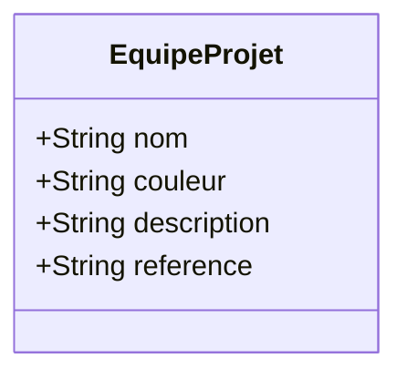

# Issue : Ajouter `couleur` et `description` à `EquipeProjet`

**Titre** : Ajout des attributs `couleur` et `description` à l'entité EquipeProjet.

## 📝 Description du Problème
Afin de mieux identifier visuellement et comprendre le rôle ou le contexte de chaque équipe projet, l'utilisateur a besoin d'associer une couleur personnalisée et une description textuelle à une `EquipeProjet`.

## 💡 Proposition de Solution (Modifications requises)
Il est nécessaire d'ajouter deux nouveaux champs à la table `equipe_projets` :
1. `couleur` : Une chaîne de caractères (`String`, optionnel ou avec valeur par défaut) pour stocker le code hexadécimal de la couleur (ex: `#ff0000`).
2. `description` : Une chaîne de caractères longue (`Text`, optionnel) pour décrire l'équipe.

**Mise à jour requise du Diagramme de Classes (Mermaid) :**

---

## 🔍 Analyse d'Impact par Composant
| Composant | Impact |
| --- | --- |
| **Database** | **Impact majeur**. Nécessite la création d'une migration pour ajouter `couleur` (string, nullable) et `description` (text, nullable) à la table `equipe_projets`. |
| **Model** | **Impact moyen**. Mettre à jour `$fillable` dans `BaseEquipeProjet`. (Automatisé par Gapp). |
| **Service** | Aucun impact particulier. |
| **Controller** | Aucun impact particulier. |
| **Blade** | **Impact sur l'UI**. Ajouter un champ de sélection de couleur (ex: type `color`) et un champ `textarea` pour la description dans le formulaire de création/édition. Afficher la couleur dans la liste (ex: badge ou pastille de couleur). |
| **Générateur (Gapp)** | **Impact Gapp**. Il faudra synchroniser le dictionnaire `db.yaml` via Gapp et régénérer le CRUD d'`EquipeProjet`. |

## 🛠️ Skills Requis pour Implémentation
- `app-migration` : Pour créer et exécuter la migration d'ajout des colonnes.
- `sys-gapp` : Pour exécuter `gapp meta:sync` (qui mettra à jour `db.yaml` avec les nouvelles colonnes) et `gapp make:crud EquipeProjet` pour régénérer le CRUD.
- `sys-conception` : Pour mettre à jour le diagramme de classe principal du module dans `cahiers-charges/PkgCreationProjet/` une fois le code validé.
