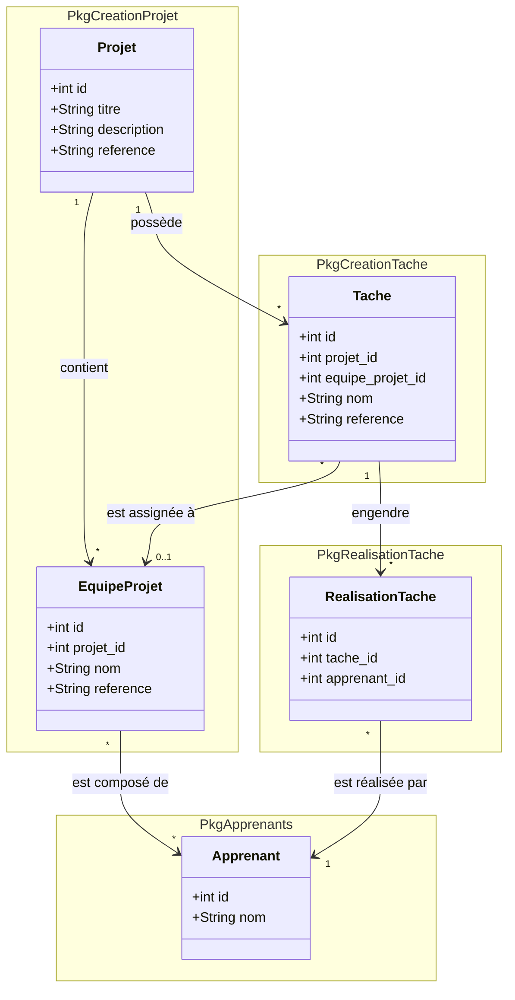

# Issue : Conception d'un Projet par Groupe (Sous-groupes d'apprenants)

## 1. Contexte et Problématique
Actuellement, un **Projet** (modèle de projet) est assigné via une **AffectationProjet** à un groupe global d'apprenants (ex: une classe).
Cependant, dans la réalité pédagogique, les apprenants travaillent souvent en sous-groupes (équipes de travail) sur un projet.
Le formateur a besoin de :
1. Créer des sous-groupes de travail pour un projet.
2. Affecter des apprenants à ces sous-groupes.
3. Lors de la création des **Tâches** du projet, pouvoir affecter une tâche à un sous-groupe spécifique.
4. Lors de la génération des **RealisationTache**, celles-ci ne doivent être créées que pour les apprenants du sous-groupe assigné à la tâche.

**Conclusion de l'analyse :**
Si les sous-groupes sont créés dans l'AffectationProjet, et que les Tâches appartiennent au Projet, il y a un décalage structurel (une tâche du modèle ne peut pas cibler un sous-groupe d'une affectation spécifique).
La solution est donc de s'orienter vers la **conception d'un "Projet par groupe"**. Ainsi, le projet n'est plus seulement un modèle générique, mais devient une instance spécifique pour une équipe/groupe d'apprenants. L'affectation devient alors une simple planification. Le groupe de travail (ou sous-groupe) doit être rattaché directement au **Projet**, soit lors de sa création, soit après la planification.

## 2. Propositions d'Architecture (Modèle de données)

### Option 1 : Projet = Instance pour une Équipe (Recommandée)
Un `Projet` gère directement ses propres `EquipeProjet` (sous-groupes).
Les `Tache`s du projet peuvent optionnellement être affectées à un groupe spécifique si le projet contient plusieurs sous-groupes.

### Modifications demandées
1. **Module `PkgCreationProjet` (Projet)** :
   - Création d'une entité `EquipeProjet` (Sous-groupe) qui appartient à un `Projet`.
   - Création de la relation Many-to-Many entre `EquipeProjet` et `Apprenant`.
2. **Module `PkgCreationTache` (Tache)** :
   - Ajout d'une clé étrangère `equipe_projet_id` (nullable) dans la table `taches` pour lier la tâche à un sous-groupe.
3. **Module `PkgRealisationTache` (RealisationTache)** :
   - Le service de création de `RealisationTache` doit filtrer les apprenants : si la tâche a un `equipe_projet_id`, créer les réalisations uniquement pour les apprenants de cette équipe. Sinon, créer pour tous les apprenants assignés au projet.

## 3. Diagramme de Classes (Mermaid) - Proposition

> **Note :** Ce diagramme est une proposition pour validation avant développement, conformément à la règle de conception.

## 4. Impact sur les Composants et Skills Nécessaires

Pour implémenter cette issue, les skills suivants seront mobilisés :
- `app-migration` : Création de la table `equipe_projets`, table pivot `apprenant_equipe_projet`, modification de `taches` (ajout `equipe_projet_id`).
- `app-model` : Mise à jour des modèles `Projet`, `Tache` et création du modèle `EquipeProjet`.
- `sys-gapp` : Synchronisation des métadonnées et régénération des CRUD.
- `app-service` : Mise à jour de `TacheService` et `RealisationTacheService` pour appliquer la logique métier (filtrage des apprenants).
- `app-controller` & `app-blade` : Mise à jour de l'interface pour permettre l'ajout d'équipes et l'affectation d'apprenants, et sélection de l'équipe dans le formulaire de création de tâche.

## 5. Règles de Gestion (Business Rules)
- **RG1** : Un formateur peut créer des `EquipeProjet` (sous-groupes) dans un `Projet`.
- **RG2** : Un apprenant ne peut appartenir qu'à une seule équipe pour un même projet.
- **RG3** : Lors de la création d'une `Tache`, le formateur peut sélectionner une `EquipeProjet`. Si sélectionnée, la tâche est exclusive à ce groupe.
- **RG4** : La génération des `RealisationTache` pour une `Tache` spécifique à une équipe ne cible que les apprenants membres de cette équipe.
